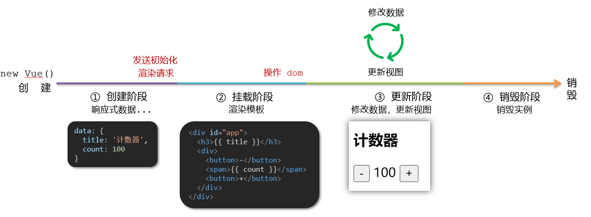
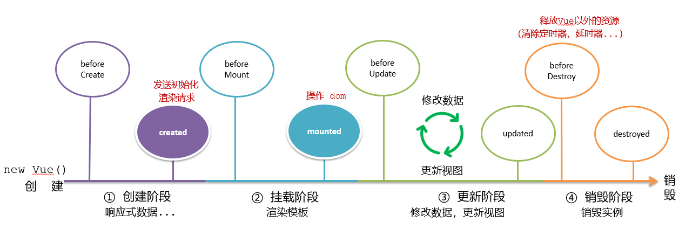
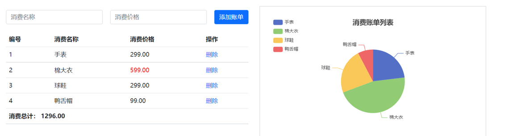
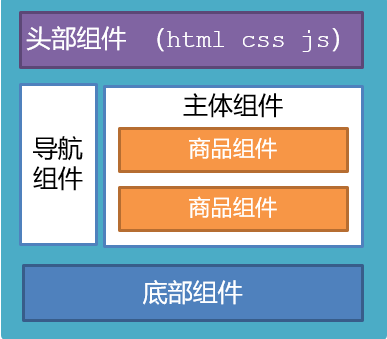

# day03

## 一、今日目标

### 1.生命周期

1. 生命周期介绍
2. 生命周期的四个阶段
3. 生命周期钩子
4. 声明周期案例

### 2.综合案例-小黑记账清单

1. 列表渲染
2. 添加/删除
3. 饼图渲染

### 3.工程化开发入门

1. 工程化开发和脚手架
2. 项目运行流程
3. 组件化
4. 组件注册

### 4.综合案例-小兔仙首页

1. 拆分模块-局部注册 
2. 结构样式完善 
3. 拆分组件 – 全局注册

## 二、Vue生命周期

思考：什么时候可以发送初始化渲染请求？（越早越好）什么时候可以开始操作dom？（至少dom得渲染出来）

Vue生命周期：就是一个Vue实例从创建 到 销毁 的整个过程。

生命周期四个阶段：① 创建 ② 挂载 ③ 更新 ④ 销毁

1.创建阶段：创建响应式数据

2.挂载阶段：渲染模板

3.更新阶段：修改数据，更新视图

4.销毁阶段：销毁Vue实例



## 三、Vue生命周期钩子

Vue生命周期过程中，会**自动运行一些函数**，被称为【**生命周期钩子**】→  让开发者可以在【**特定阶段**】运行**自己的代码**



```html
  <div id="app">
    <h3>{{ title }}</h3>
    <div>
      <button @click="count--">-</button>
      <span>{{ count }}</span>
      <button @click="count++">+</button>
    </div>
  </div>

  <script>
    const app = new Vue({
      el: '#app',
      data: {
        count: 100,
        title: '计数器'
      },
      // 1. 创建阶段（准备数据）
      beforeCreate () {
        console.log('beforeCreate 响应式数据准备好之前', this.count)
      },
      created () {
        console.log('created 响应式数据准备好之后', this.count)
        // this.数据名 = 请求回来的数据
        // 可以开始发送初始化渲染的请求了
      },

      // 2. 挂载阶段（渲染模板）
      beforeMount () {
        console.log('beforeMount 模板渲染之前', document.querySelector('h3').innerHTML)
      },
      mounted () {
        console.log('mounted 模板渲染之后', document.querySelector('h3').innerHTML)
        // 可以开始操作dom了
      },

      // 3. 更新阶段(修改数据 → 更新视图)
      beforeUpdate () {
        console.log('beforeUpdate 数据修改了，视图还没更新', document.querySelector('span').innerHTML)
      },
      updated () {
        console.log('updated 数据修改了，视图已经更新', document.querySelector('span').innerHTML)
      },

      // 4. 卸载阶段
      beforeDestroy () {
        console.log('beforeDestroy, 卸载前')
        console.log('清除掉一些Vue以外的资源占用，定时器，延时器...')
      },
      destroyed () {
        console.log('destroyed，卸载后')
      }
    })
  </script>
```

## 四、生命周期钩子小案例

### 1.在created中发送数据

```html
  <div id="app">
    <ul>
      <li v-for="(item, index) in list" :key="item.id" class="news">
        <div class="left">
          <div class="title">{{ item.title }}</div>
          <div class="info">
            <span>{{ item.source }}</span>
            <span>{{ item.time }}</span>
          </div>
        </div>
        <div class="right">
          
        </div>
      </li>
    </ul>
  </div>

  <script>
    // 接口地址：http://hmajax.itheima.net/api/news
    // 请求方式：get
    const app = new Vue({
      el: '#app',
      data: {
        list: []
      },
      async created () {
        // 1. 发送请求获取数据
        const res = await axios.get('http://hmajax.itheima.net/api/news')
        // 2. 更新到 list 中，用于页面渲染 v-for
        this.list = res.data.data
      }
    })
  </script>
```

### 2.在mounted中获取焦点

```html
<div class="container" id="app">
  <div class="search-container">
    
    <div class="search-box">
      <input type="text" v-model="words" id="inp">
      <button>搜索一下</button>
    </div>
  </div>
</div>

<script>
  const app = new Vue({
    el: '#app',
    data: {
      words: ''
    },
    // 核心思路：
    // 1. 等input框渲染出来 mounted 钩子
    // 2. 让input框获取焦点 inp.focus()
    mounted () {
      document.querySelector('#inp').focus()
    }
  })
</script>
```

## 五、案例-小黑记账清单

### 1.需求图示：



### 2.需求分析

1.基本渲染

2.添加功能

3.删除功能

4.饼图渲染

### 3.思路分析

1.基本渲染  

- 立刻发送请求获取数据 created
- 拿到数据，存到data的响应式数据中
- 结合数据，进行渲染 v-for
- 消费统计  —> 计算属性

2.添加功能

- 收集表单数据 v-model，使用指令修饰符处理数据
- 给添加按钮注册点击事件，对输入的内容做非空判断，发送请求
- 请求成功后，对文本框内容进行清空
- 重新渲染列表

3.删除功能

- 注册点击事件，获取当前行的id
- 根据id发送删除请求
- 需要重新渲染

4.饼图渲染

- 初始化一个饼图 echarts.init(dom)    mounted钩子中渲染
- 根据数据试试更新饼图 echarts.setOptions({...})

### 4.代码

```html
    <div id="app">
      <div class="contain">
        <!-- 左侧列表 -->
        <div class="list-box">

          <!-- 添加资产 -->
          <form class="my-form">
            <input v-model.trim="name" type="text" class="form-control" placeholder="消费名称" />
            <input v-model.number="price" type="text" class="form-control" placeholder="消费价格" />
            <button @click="add" type="button" class="btn btn-primary">添加账单</button>
          </form>

          <table class="table table-hover">
            <thead>
              <tr>
                <th>编号</th>
                <th>消费名称</th>
                <th>消费价格</th>
                <th>操作</th>
              </tr>
            </thead>
            <tbody>
              <tr v-for="(item, index) in list" :key="item.id">
                <td>{{ index + 1 }}</td>
                <td>{{ item.name }}</td>
                <td :class="{ red: item.price > 500 }">{{ item.price.toFixed(2) }}</td>
                <td><a @click="del(item.id)" href="javascript:;">删除</a></td>
              </tr>
            </tbody>
            <tfoot>
              <tr>
                <td colspan="4">消费总计： {{ totalPrice.toFixed(2) }}</td>
              </tr>
            </tfoot>
          </table>
        </div>
        
        <!-- 右侧图表 -->
        <div class="echarts-box" id="main"></div>
      </div>
    </div>

    <script>
      const app = new Vue({
        el: '#app',
        data: {
          list: [],
          name: '',
          price: ''
        },
        computed: {
          totalPrice () {
            return this.list.reduce((sum, item) => sum + item.price, 0)
          }
        },
        created () {//立刻发送请求获取数据 created
          // const res = await axios.get('https://applet-base-api-t.itheima.net/bill', {
          //   params: {
          //     creator: '小黑'
          //   }
          // })
          // this.list = res.data.data

          this.getList()
        },
        mounted () {
          this.myChart = echarts.init(document.querySelector('#main'))
          this.myChart.setOption({
            // 大标题
            title: {
              text: '消费账单列表',
              left: 'center'
            },
            // 提示框
            tooltip: {
              trigger: 'item'
            },
            // 图例
            legend: {
              orient: 'vertical',
              left: 'left'
            },
            // 数据项
            series: [
              {
                name: '消费账单',
                type: 'pie',
                radius: '50%', // 半径
                data: [
                  // { value: 1048, name: '球鞋' },
                  // { value: 735, name: '防晒霜' }
                ],
                emphasis: {
                  itemStyle: {
                    shadowBlur: 10,
                    shadowOffsetX: 0,
                    shadowColor: 'rgba(0, 0, 0, 0.5)'
                  }
                }
              }
            ]
          })
        },
        methods: {
          async getList () {
            const res = await axios.get('https://applet-base-api-t.itheima.net/bill', {
              params: {
                creator: '小黑'
              }
            })
            this.list = res.data.data

            // 更新图表
            this.myChart.setOption({
              // 数据项
              series: [
                {
                  // data: [
                  //   { value: 1048, name: '球鞋' },
                  //   { value: 735, name: '防晒霜' }
                  // ]
                  data: this.list.map(item => ({ value: item.price, name: item.name}))
                }
              ]
            })
          },
          async add () {//给添加按钮注册点击事件，发送添加请求
            if (!this.name) {
              alert('请输入消费名称')
              return
            }
            if (typeof this.price !== 'number') {
              alert('请输入正确的消费价格')
              return
            }

            // 发送添加请求
            const res = await axios.post('https://applet-base-api-t.itheima.net/bill', {
              //收集表单数据 v-model
              creator: '小黑',
              name: this.name,
              price: this.price
            })
            // 重新渲染一次
            this.getList()

            this.name = ''
            this.price = ''
          },
          async del (id) {
            // 根据 id 发送删除请求
            const res = await axios.delete(`https://applet-base-api-t.itheima.net/bill/${id}`)
            // 重新渲染
            this.getList()
          }
        }
      })
    </script>
```

## 六、工程化开发和脚手架

### 1.开发Vue的两种方式

- 核心包传统开发模式：基于html / css / js 文件，直接引入核心包，开发 Vue。
- **工程化开发模式：基于构建工具（例如：webpack）的环境中开发Vue。**


工程化开发模式优点：

   提高编码效率，比如使用JS新语法、Less/Sass、Typescript等通过webpack都可以编译成浏览器识别的ES3/ES5/CSS等

工程化开发模式问题：

- webpack配置**不简单**
- **雷同**的基础配置
- 缺乏**统一的标准**

为了解决以上问题，所以我们需要一个工具，生成标准化的配置

### 2.脚手架Vue CLI

####   基本介绍：

   Vue CLI 是Vue官方提供的一个**全局命令工具**

   可以帮助我们**快速创建**一个开发Vue项目的**标准化基础架子**。【集成了webpack配置】

####    好处：

1. 开箱即用，零配置
2. 内置babel等工具
3. 标准化的webpack配置

####    使用步骤：

1. 全局安装（只需安装一次即可） yarn global add @vue/cli 或者 npm i @vue/cli -g
2. 查看vue/cli版本： vue --version
3. 创建项目架子：**vue create project-name**(项目名不能使用中文)
4. 启动项目：**yarn serve** 或者 **npm run serve**(命令不固定，找package.json)

## 七、项目目录介绍和运行流程

### 1.项目目录介绍


虽然脚手架中的文件有很多，目前咱们只需人事三个文件即可

1. main.js  入口文件
2. App.vue  App根组件 
3. index.html 模板文件

### 2.运行流程


## 八、组件化开发

​     组件化：一个页面可以拆分成一个个组件，每个组件有着自己独立的结构、样式、行为。

​     好处：便于维护，利于复用 → 提升开发效率。

​     组件分类：普通组件、根组件。

​      比如：下面这个页面，可以把所有的代码都写在一个页面中，但是这样显得代码比较混乱，难易维护。咱们可以按模块进行组件划分



总结：

组件化的好处是什么？

组件的分类？

## 九、根组件 App.vue

### 1.根组件介绍

整个应用最上层的组件，包裹所有普通小组件


### 2.组件是由三部分构成

- 语法高亮插件


- 三部分构成

  - template：结构 （有且只能一个根元素）
  - script:   js逻辑 
  -  style： 样式 (可支持less，需要装包)

- 让组件支持less

  （1） style标签，lang="less" 开启less功能 

  （2） 装包: yarn add less less-loader -D 或者npm i less less-loader -D

### 3.总结

App组件包含哪三部分？

## 十、普通组件的注册使用-局部注册

### 1.特点：

只能在注册的组件内使用

### 2.步骤：

1. 创建.vue文件（三个组成部分）
2. 在使用的组件内先导入再注册，最后使用

### 3.使用方式：

当成html标签使用即可  <组件名></组件名>

### 4.注意：

组件名规范 —> 大驼峰命名法， 如 HmHeader

### 5.语法：


```js
// 导入需要注册的组件
import 组件对象 from '.vue文件路径'
import HmHeader from './components/HmHeader'

export default {  // 局部注册
  components: {
   '组件名': 组件对象,
    HmHeader:HmHeaer,
    HmHeader
  }
}
```

### 6.代码

在App组件中，完成以下练习。在App.vue中使用组件的方式完成下面布局


```vue
<template>
  <div class="hm-header">
    我是hm-header
  </div>
</template>
```

```vue
<template>
  <div class="hm-main">
    我是hm-main
  </div>
</template>
```

```vue
<template>
  <div class="hm-footer">
    我是hm-footer
  </div>
</template>
```

```vue
<template>
  <div class="App">
    <!-- 头部组件 -->
    <HmHeader></HmHeader>
    <!-- 主体组件 -->
    <HmMain></HmMain>
    <!-- 底部组件 -->
    <HmFooter></HmFooter>

    <!-- 如果 HmFooter + tab 出不来 → 需要配置 vscode
         设置中搜索 trigger on tab → 勾上
    -->
  </div>
</template>

<script>
import HmHeader from './components/HmHeader.vue'
import HmMain from './components/HmMain.vue'
import HmFooter from './components/HmFooter.vue'
export default {
  components: {
    // '组件名': 组件对象
    HmHeader: HmHeader,
    HmMain,
    HmFooter
  }
}
</script>
```

### 7.总结

- A组件内部注册的局部组件能在B组件使用吗
- 局部注册组件的步骤是什么
- 使用组件时 应该按照什么命名法

## 十一、普通组件的注册使用-全局注册

### 1.特点：

全局注册的组件，在项目的**任何组件**中都能使用

### 2.步骤

1. 创建.vue组件（三个组成部分）
2. **main.js**中进行全局注册

### 3.使用方式

当成HTML标签直接使用

> <组件名></组件名>

### 4.注意

组件名规范 —> 大驼峰命名法， 如 HmHeader

### 5.语法

Vue.component('组件名', 组件对象)

例：

```js
// 在main.js导入需要全局注册的组件
import HmButton from './components/HmButton'
Vue.component('HmButton', HmButton)
```

### 6.代码

在以下3个局部组件中是展示一个通用按钮


```js
// main.js文件核心作用：导入App.vue，基于App.vue创建结构渲染index.html
import Vue from 'vue'
import App from './App.vue'
// 编写导入的代码，往代码的顶部编写(规范)
import HmButton from './components/HmButton'
Vue.config.productionTip = false

// 进行全局注册 → 在所有的组件范围内都能直接使用
// Vue.component(组件名，组件对象)
Vue.component('HmButton', HmButton)


// Vue实例化，提供render方法 → 基于App.vue创建结构渲染index.html
new Vue({
  // render: h => h(App),
  render: (createElement) => {
    // 基于App创建元素结构
    return createElement(App)
  }
}).$mount('#app')
```

```vue
<template>
  <div class="hm-header">
    我是hm-header
    <HmButton>通用按钮</HmButton>
  </div>
</template>
```
```vue
<template>
  <div class="hm-main">
    我是hm-main
    <HmButton>通用按钮</HmButton>
  </div>
</template>
```
```vue
<template>
  <div class="hm-footer">
    我是hm-footer
    <HmButton>通用按钮</HmButton>
  </div>
</template>
```

### 7.总结

1.全局注册组件应该在哪个文件中注册以及语法是什么？

2.全局组件在项目中的任何一个组件中可不可以使用？

## 十二、综合案例

### 1.小兔仙首页启动项目演示

### 2.小兔仙组件拆分示意图


### 3.开发思路

1. 分析页面，按模块拆分组件，搭架子  (局部或全局注册)

2. 根据设计图，编写组件 html 结构 css 样式 (已准备好)

3. 拆分封装通用小组件  (局部或全局注册)

   将来 → 通过 js 动态渲染，实现功能

